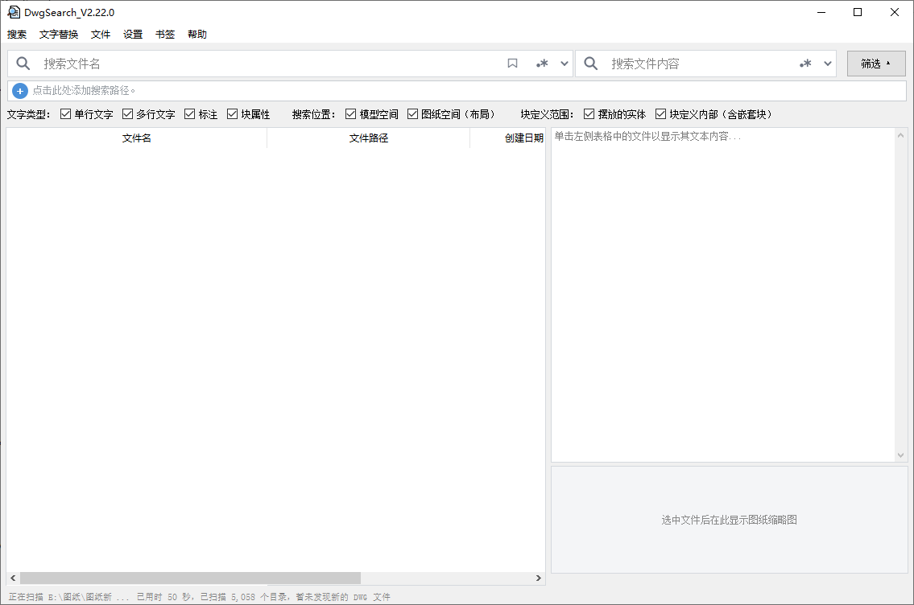
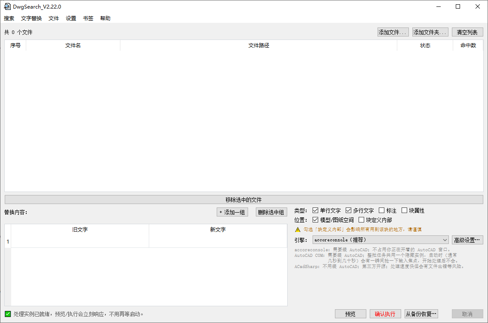

# DwgSearch

> **批量搜索 / 替换 DWG 图纸文件名与文字内容的桌面工具**
> 本地建立索引，支持按文件名、正文内容关键词（含正则表达式）快速检索。

---

## 📥 下载

| 版本 | 类型 | 适用场景 |
|------|------|----------|
| **[便携版（自动跳转最新版）](https://github.com/DwgSearch/DwgSearch/releases/latest)** | `.zip`（单文件夹模式） | 免安装、绿色运行、Win7/10/11 通用 |

国内下载较慢可以用国内镜像：**[Gitee Release 列表](https://gitee.com/h1985/DwgSearch/releases)**（同样是最新版在最上面）

软件内「帮助 → 检查更新」可以随时查有没有新版本，也会在有更新时自动在菜单项上提示一个小红点。

---

## ✨ 核心功能

| 功能 | 说明 |
|------|------|
| **全文检索** | 索引 DWG 图纸内的文字内容（模型空间、图纸空间、块定义、属性块） |
| **文件名搜索** | 支持通配符 `*`（任意多个字符）`?`（恰好一个字符），如 `N-3*装配图`；也支持正则表达式；不区分大小写 |
| **图纸缩略图** | 选中文件后在预览区下方显示 DWG 内嵌的预览图，无需安装 CAD |
| **批量替换** | 三种引擎可选（accoreconsole / AutoCAD COM / ACadSharp），支持预览、自动备份、按类型/位置精细控制替换范围 |
| **右键菜单集成** | 在「设置 → 集成到右键菜单」开启后，资源管理器右键文件夹 →「用 DWG 图纸搜索工具搜索此目录」 |
| **书签收藏** | 一键保存常用「文件名+内容」搜索条件 |
| **多窗口** | `Ctrl+Shift+N` 新建独立窗口，共享同一后台索引 |
| **系统托盘** | 关闭窗口最小化到托盘，后台索引继续运行 |
| **替换备份/恢复** | 替换前自动备份原文件，可按批次一键恢复；索引数据库的存放位置可自定义 |

---

## 🖼️ 界面预览

### 主界面 - 搜索与索引

### 批量替换页面

---

## 🖥️ 系统要求

| 组件 | 要求 |
|------|------|
| **操作系统** | Windows 7 SP1 / 8 / 10 / 11（x64） |
| **.NET Runtime** | 需要 .NET Framework 4.8（Win7 需手动安装，Win10/11 一般已预装） |

---

## 🚀 快速开始

1. 下载并解压便携版到任意文件夹（如 `D:\Tools\DwgSearch`）
2. 双击 `DwgSearch.exe` 运行
3. 软件启动约 3 秒后会自动在后台索引本机所有固定硬盘（状态栏显示「后台索引中」），索引期间就可以搜索，只是结果可能暂时不全
4. 想只搜某些目录：点搜索目录栏的「+」添加目录并勾选（一个都不勾 = 搜全部）；网络盘、U 盘不会被自动扫描，添加并勾选后搜索即可优先索引

---

## 📖 使用指南

### 搜索
- 「文件名」「内容」两个框可以分别填、也可以一起填（自动"与"逻辑）；每个框里可用空格隔开多个关键词，需同时满足；每个词至少 2 个字符；不区分大小写
- 文件名支持通配符：`*` 匹配任意多个字符，`?` 匹配恰好一个字符，关键词命中文件名任意位置即可（如 `图纸?.dwg`、`M-12*UHF*01`）；内容搜索不支持通配符
- 支持正则表达式（点搜索框右侧的 `.*` 图标切换）；结果表格可以自己选要显示哪些列（路径/日期/DWG版本/大小等）

### 批量替换
1. 顶部菜单栏「搜索」/「文字替换」两个按钮可以来回切换页面，切走不会中断正在跑的替换任务
2. 两种进入方式：直接点「文字替换」自己在页面里加文件；或者在搜索结果里选中几行、右键「替换选中项」自动带过去
3. 填写「旧文字 → 新文字」（可以填多组），勾选要替换的类型（单行文字/多行文字/标注/块属性）和位置（模型/图纸空间、块定义内部）
4. 点击「预览」确认命中情况 →「确认执行」
5. 执行前会自动备份原文件，执行完可以在「从备份恢复」里找回

---

## 🔒 许可证与免责声明

**本软件仅提供二进制分发，源代码不公开。**

- ✅ 允许：免费下载、个人/商业用途使用、通过原始 Release 页面链接分享
- ❌ 禁止：反编译、逆向工程、修改二进制、去除版权/水印、重新打包分发
- ⚠️ 按「现状」提供，不承担任何直接/间接损失责任
- 📄 完整条款见 [LICENSE](LICENSE) / Release 页面「License」栏

---

## 🛡️ 安全提示

- 代码签名：暂无 EV 证书，SmartScreen 可能提示「未识别的应用」——点击「更多信息」→「仍要运行」
- 杀毒误报：PyInstaller 打包的单文件夹模式容易被启发式误报，可上传 [VirusTotal](https://www.virustotal.com/) 确认

---

## 🐛 问题反馈

| 渠道 | 说明 |
|------|------|
| **GitHub Issues** | [提交 Bug / 功能建议](https://github.com/DwgSearch/DwgSearch/issues) |
| **Gitee Issues** | [国内镜像反馈入口](https://gitee.com/h1985/DwgSearch/issues) |
| **邮箱** | `378600950@qq.com`（仅限无法公开的安全/隐私问题） |

---

## 🙏 致谢

- [ACadSharp](https://github.com/ACadSharp/ACadSharp) — 纯 .NET DWG/DXF 读写库
- [PyInstaller](https://pyinstaller.org/) — Python 打包工具
- [PyQt5](https://www.riverbankcomputing.com/software/pyqt/) — GUI 框架

---

## 📞 联系作者

- **主页**：[GitHub](https://github.com/DwgSearch/DwgSearch) ｜ [Gitee](https://gitee.com/h1985/DwgSearch)
- **Email**: 378600950@qq.com

---
## 💴 赞助
> **如果这个工具帮你省了时间，欢迎赞助支持！ —— 完全自愿，不给也完全不影响使用。**

---

## ⭐ Star History
> **支持开发者的最简单方式是点击页面顶部的星标（⭐）**

---
